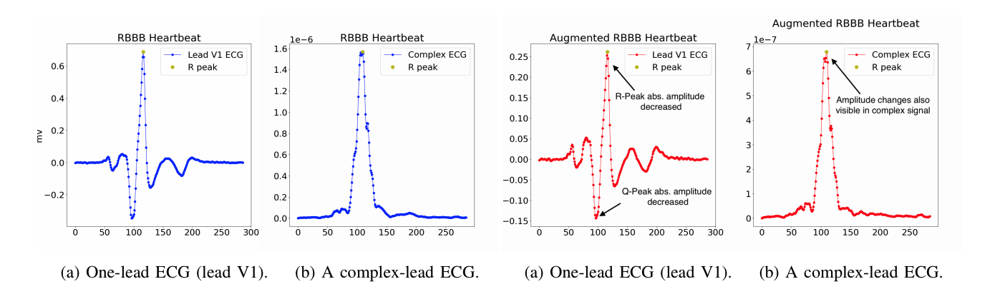
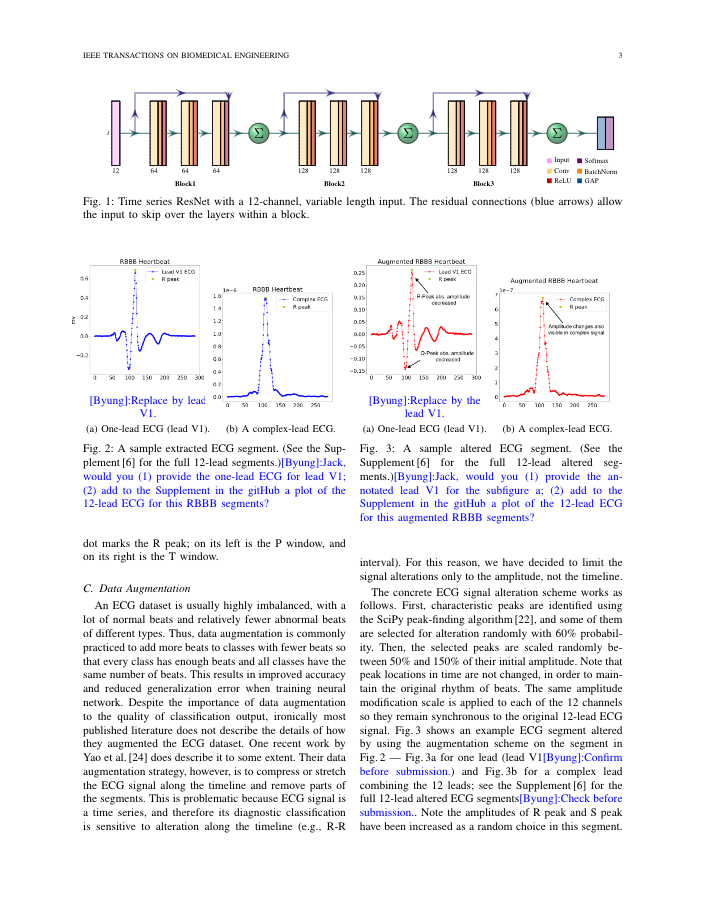

### 12-Lead Imbalanced ECG Beat Classification Using Time Series ResNet

This repository contains supplementary materials from a research project for classifying ECG beat segments into diagnostic classes defined by PhysioBank.
Thus far, the following materials have been uploaded.
1. Full 12 lead ECG segments of an RBBB beat from the original ECG data set ([link](supplemental_plots/Figure2)).
2. Full 12 lead ECG segments of an RBBB beat randomly altered during ECG data augmentation ([link](supplemental_plots/Figure3)).
3. Test results in the four augmentation scenarios (EXP 1 - 4) ([link](test_results.md)).
4. Detailed_results.xlsx: details of the training accuracy and test accuracy in ECG segment classification ([link](result_details.xlsx)).
5. ECG filtering code: ** Edmund will add a link here. ***
6. ECG segmentation code: ** Edmund will add a link here. ***
7. ECG augmentation: [README](augmentation/README.md).
  
8. Model code ([link](resnet/resnet.py)).
  
9. Class activation mapping code ([link](class_activation_map/cam.py)).
